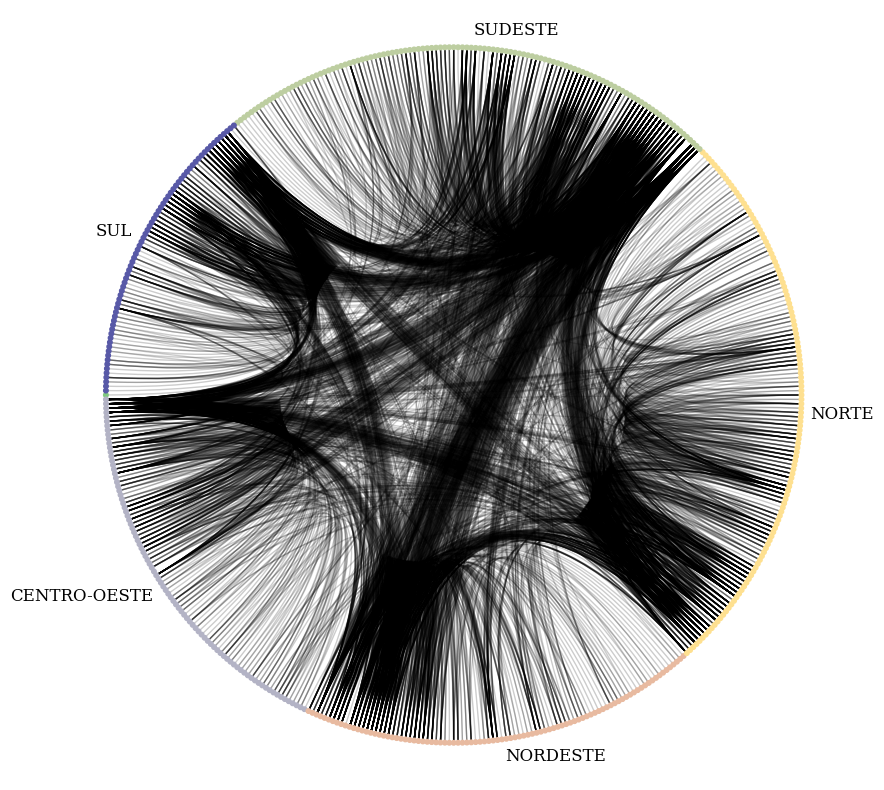
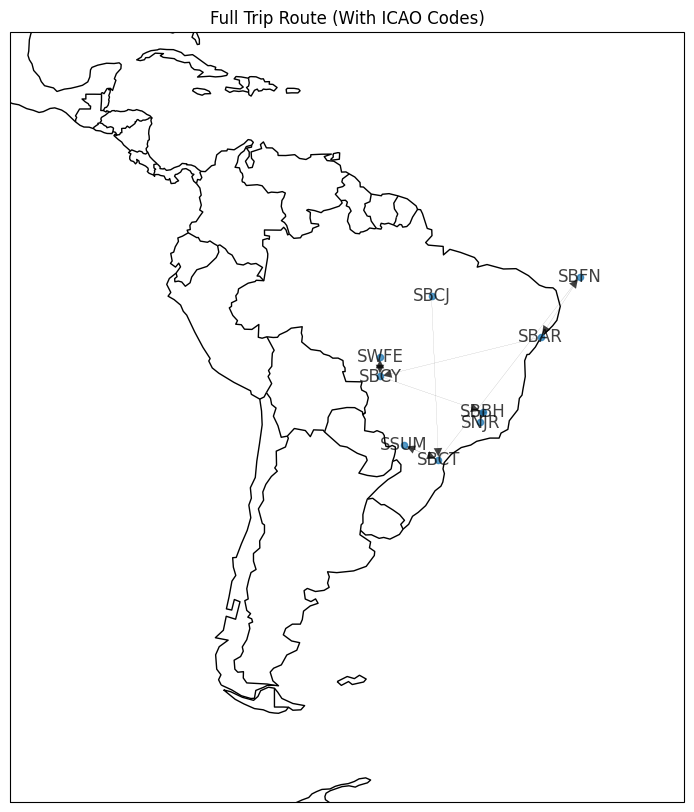

## Week 10
# Brazillian Air Traffic Analysis

*Photo by <a href="https://unsplash.com/fr/@oskark?utm_source=unsplash&utm_medium=referral&utm_content=creditCopyText">Oskar Kadaksoo</a> on <a href="https://unsplash.com/photos/DDBDkz0p918?utm_source=unsplash&utm_medium=referral&utm_content=creditCopyText">Unsplash</a>*
  

**This is the first multi-week project for Algorithms and Data Strucutures II.**

The goal of the project is to analyze brazillian air traffic while making use of the graph algorithms taught so far in the class. The data used in this project can be found [here](https://github.com/alvarofpp/dataset-flights-brazil).

This project was done together with [Sidney Alves](https://github.com/SidneyJunior01234), who has written a [similar README](https://github.com/SidneyJunior01234/DCA0209---ALGORITMOS-E-ESTRUTURAS-DE-DADOS-II---T01/tree/main/Air%20traffic%20Brazil%20analysis) to this one as well as recorded a [video](https://www.youtube.com/watch?v=Yp7GAfcOzGg&ab_channel=SidneyJunior) briefly going over it (both of which are in portuguese).

The analysis will be divided into 4 parts: *assortativity analysis, bivariate analysis, trip simulation, and clustering analysis.*

## Assortativity Analysis

The first part constitues calculating the *assortativity coefficient* for the air traffic graph. In graphs, the assortativity coefficient is a measure of how much homophily is driving the network's connections. Homophily relates to the likelyhood of similar elements being grouped together. In the case of networks, it implies that nodes connect to one another if they have similar attributes. 

The assortativity coeffcient was caclualted for the **brazillian air traffic network** based on the attribute that pertains to the airport's region. The values for the metric range from **-1** to **1**. The result is as follows:

`Assortativity Coefficient = 0.36728130173582757`

The positive value above indicates that similar nodes are in fact more likely to establish edges between each other. To better illustrate this, the network was plotted as follows.

## Bivariate Analysis

WIP

## Trip Simulation

In the third part, the objective was to simulate a trip across 5 destinations, each located in a different region of Brazil, while taking the shortest possible route between them.

This was done by choosing 5 destination airports at random and using a shortest path algorithm to calculate the full route including all intermediate stops. The resulting flight simulation is illustrated in the image below.

## Clustering Analysis

The fourth and last part relates to the analysis of the clustering coefficient, which measures the likelyhood that the neighbor of a node's neighbor is also its neighbor. It's calculated in each node's ego network and corresponds to the fraction of possible triangles that contain the node. Taking the average for all nodes gives the coefficient for the network or subnetwork being analyzed.

The metric was calculated for the overall network as well as subnetworks corresponding to each region, as shown below:

`Nation-Wide Clustering Coefficient = 0.623050800236936`

`The Center-East's Clustering Coefficient = 0.5979416718387066`

`The Northeast's Clustering Coefficient = 0.43807384418290285`

`The North's Clustering Coefficient = 0.6159653188854737`

`The Southeast's Clustering Coefficient = 0.6186700538769274`

`The South's Clustering Coefficient = 0.5979416718387066`

[Back to the repository page](https://github.com/ThiagoFPMR/DCA0209)